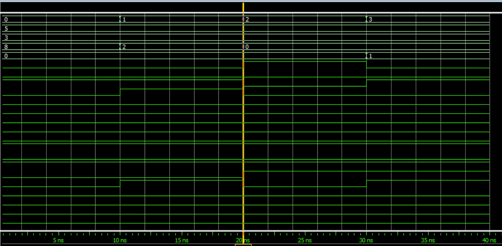

# 8-Bit Arithmetic Logic Unit (ALU) Design

This repository contains a gate-level implementation of an **8-Bit Arithmetic Logic Unit (ALU)** designed using **Verilog HDL**. The project demonstrates hierarchical design principles, including custom decoders, enable blocks, and fundamental logic/arithmetic units.

## 🚀 Features
The ALU supports 4 distinct operation modes selected via 2-bit control signals ($s_1, s_0$):

1. **Arithmetic (00/01):** Addition and Subtraction with **Carry/Borrow** output.
2. **Comparison (10):** Magnitude comparison providing **Greater Than (GT)**, **Equal To (EQ)**, and **Less Than (LT)** flags.
3. **Bitwise Logic (11):** 8-bit bitwise **AND** operation.

## 📂 Repository Structure
* `main_module.v`: Top-level entity integrating all sub-modules.
* `decoder_module.v`: 2-to-4 decoder for operation selection.
* `enable_module.v`: Control logic for power efficiency.
* `add_sub_module.v`: 8-bit ripple-carry adder/subtractor.
* `comparator.v`: 8-bit magnitude comparator logic.
* `and_module.v`: Bitwise AND logic unit.
* `tb_main_module.v`: Comprehensive testbench for verification.
* `wave.do`: Pre-configured waveform format for ModelSim/QuestaSim.

## 🛠 Tools Used
* **Design & Synthesis:** Intel Quartus Prime.
* **Simulation:** Questa Intel FPGA Edition / ModelSim.

## 📊 Simulation Results
The design has been fully verified. Below is the simulation waveform:

## 📖 How to Run
1. Open `ALU_8bit.qpf` in **Quartus Prime**.
2. Run **RTL Simulation** to open Questa/ModelSim.
3. In the ModelSim console, type `do wave.do` to load the waveform layout.
