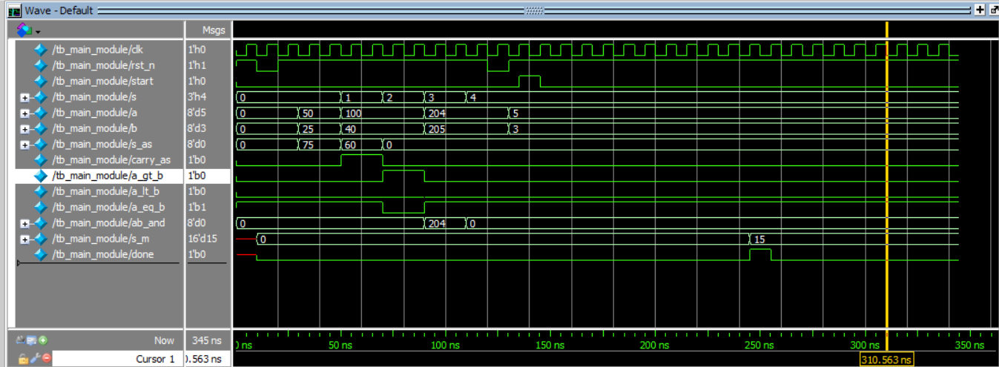

# 8-Bit Arithmetic Logic Unit (ALU) with FSM Multiplier

This repository contains a gate-level and behavioral implementation of an **8-Bit Arithmetic Logic Unit (ALU)** designed using Verilog HDL. The project demonstrates hierarchical design principles, including custom decoders, enable blocks, and a **sequential FSM-based multiplier**.

🚀 ## Features

The ALU supports 5 distinct operation modes selected via a 3-bit control signal ($s_2, s_1, s_0$):

1. **Arithmetic (000/001):** Addition and Subtraction with Carry/Borrow output.
2. **Comparison (010):** Magnitude comparison providing Greater Than (GT), Equal To (EQ), and Less Than (LT) flags.
3. **Bitwise Logic (011):** 8-bit bitwise AND operation.
4. **Sequential Multiplication (100):** 8-bit multiplication using the **Shift-and-Add algorithm** controlled by a **Finite State Machine (FSM)**.
   - Features a `done` flag and an 8-cycle calculation process.

📂 ## Repository Structure

- `main_module.v`: Top-level entity integrating all sub-modules.
- `multiplier_fsm.v`: Sequential multiplier logic with FSM (IDLE, CALC, DONE states).
- `decoder_module.v`: Decoder for operation selection.
- `add_sub_module.v`: 8-bit ripple-carry adder/subtractor.
- `comparator.v`: 8-bit magnitude comparator logic.
- `and_module.v`: Bitwise AND logic unit.
- `tb_main_module.v`: Comprehensive testbench for all operations.
- `wave.do`: Pre-configured waveform format for ModelSim/QuestaSim.
- `wave_result.png`: Simulation waveform results.

🛠 ## Tools Used

- **Design & Synthesis:** Intel Quartus Prime.
- **Simulation:** Questa Intel FPGA Edition / ModelSim.

📊 ## Simulation Results

The design has been fully verified. Below is the simulation waveform showing various operations, including the 8-cycle multiplication process:

📖 ## How to Run

1. Open `ALU_8bit.qpf` in **Quartus Prime**.
2. Run **RTL Simulation** to open Questa/ModelSim.
3. In the ModelSim console, type `do wave.do` to load the professional waveform layout.
4. Run the simulation using `run -all`.

📜 ## Acknowledgments

This project is an upgraded version based on the original 4-bit ALU design by **Soumil Gupta**.

- **Changes made:**
  - Expanded data width from 4-bit to **8-bit**.
  - **Added a Sequential FSM Multiplier** (Shift-and-Add algorithm).
  - Optimized the 8-bit comparator logic.
  - Added custom testbench and `.do` configuration for professional verification.
